Tor for Linux
=========================

Anonymity Online

**Lesson to read: [Online Privacy](umbrella://communications/online-privacy/advanced)**  
**Level**: Beginner-Advanced  
**Time required**: 15 minutes—1 hour   
**Published:** April 2018    
**Sources:** Surveillance Self-Defense (EFF), [How to: Use Tor for Linux](https://ssd.eff.org/en/module/how-use-tor-linux); Security in a Box [TOR BROWSER FOR LINUX - ONLINE ANONYMITY AND CIRCUMVENTION](https://securityinabox.org/en/guide/torbrowser/linux/). 

**Using Tor will give you:**    

* The ability to conceal your digital identity from the websites that you visit  
* The ability to conceal the websites you visit from Internet Service Providers and surveillance programmes
* The ability to bypass Internet censorship and filtering  
* Protection from insecure and potentially malicious websites through the HTTPS Everywhere and NoScript browser add-ons

**Download location:** [https://www.torproject.org/download/download-easy.html.en](https://www.torproject.org/download/download-easy.html.en). If you can't access this website, read *If the Download Page is Blocked*, below.   
**Computer requirements:** An Internet connection, a computer running your favorite Linux distribution.  
**Version used in this guide**: Ubuntu 16.04.1 LTS; Tor Browser: 7.0.2  
**License**: Free Software; mix of Free Software licenses

Introduction 
-------------

This guide outlines how to use [Tor Browser](https://www.torproject.org/projects/torbrowser.html.en) on Linux.

Tor is a volunteer-run service that provides both privacy and anonymity online by masking who you are and where you are connecting. The service also protects you from the Tor network itself—you can have good assurance that you’ll remain anonymous to other Tor users.

For people who might need occasional anonymity and privacy when accessing websites, Tor Browser provides a quick and easy way to use the Tor network.

The Tor Browser works just like a web browser, the program you use to view web sites. Examples include Chrome, Firefox, and Safari. Unlike other web browsers, though, the Tor Browser sends your communications through Tor, making it harder for people who are monitoring you to know exactly what you're doing online, and harder for people monitoring the sites you use to know where you're connecting from.

Keep in mind that only activities you do inside of Tor Browser itself will be anonymized. Having Tor Browser installed on your computer does not make things you do on the same computer using other software (such as your regular web browser) anonymous.

**Other reading**:

*   [https://www.torproject.org/docs/documentation.html.en](https://www.torproject.org/docs/documentation.html.en)
*   [https://tor.stackexchange.com/](https://tor.stackexchange.com/)
*   [https://www.eff.org/pages/tor-and-https](https://www.eff.org/pages/tor-and-https)
 

Getting Tor Browser
-------------------------------------

Open a browser like Firefox or Chrome and go to:

[https://www.torproject.org/download/download-easy.html.en](https://www.torproject.org/download/download-easy.html.en)

If you are using a search engine to look for the Tor Browser, make sure that the URL is correct.

Do not use any other source, and if you are prompted to accept alternative HTTPS (SSL/TLS) security certificates, do not proceed.

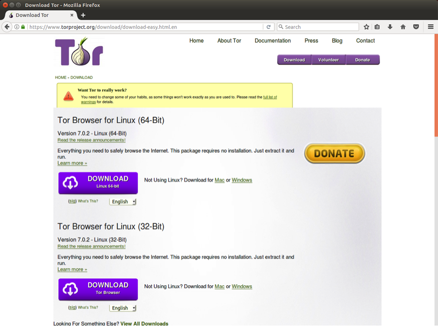

The website will have detected your operating system and you'll get the correct file for your operating system. If this fails you can click the link to the side of the purple button to download the correct version.

Some browsers will ask you to confirm whether you want to download this file. Firefox shows a pop-up box in the middle of your browser window. For any browser, it is best to save the file first before proceeding. Click the Save button.

This example shows Tor Browser version 7.0.2. There may be a more recent version of Tor Browser available for download by the time you read this, so please download and use the current version that Tor Project provides.

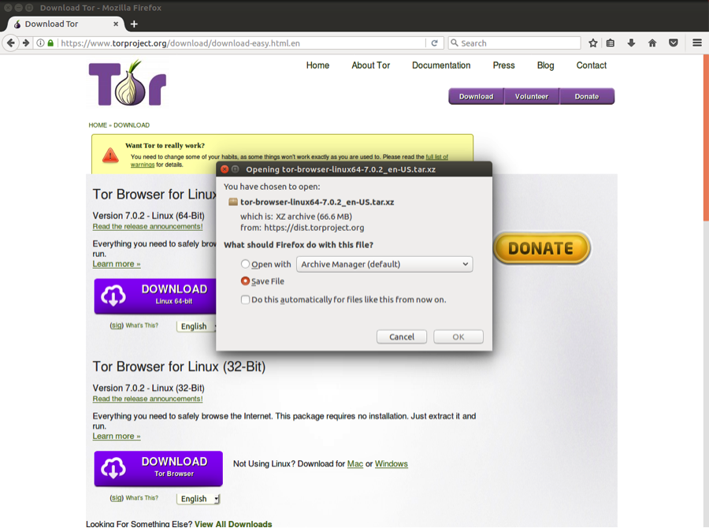

Installing Tor Browser 
----------------------------------------

After the download is complete, go to your Downloads folder. You should always make sure you trust the software you want to install and that you got an authentic copy from the official site over a secure connection. Since you know what you want, and you know where to get the software, and the download was from the Tor Project's secure HTTPS site, double-click on the file “tor-browser-linux64-7.0.2_en-US.tar.xz”.

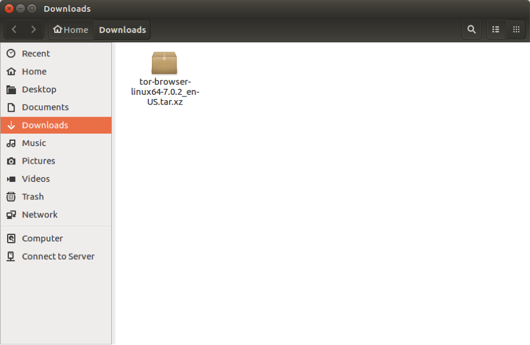

After double-clicking on the Tor Browser archive file, wait for it to load then choose where you want to extract its contents.

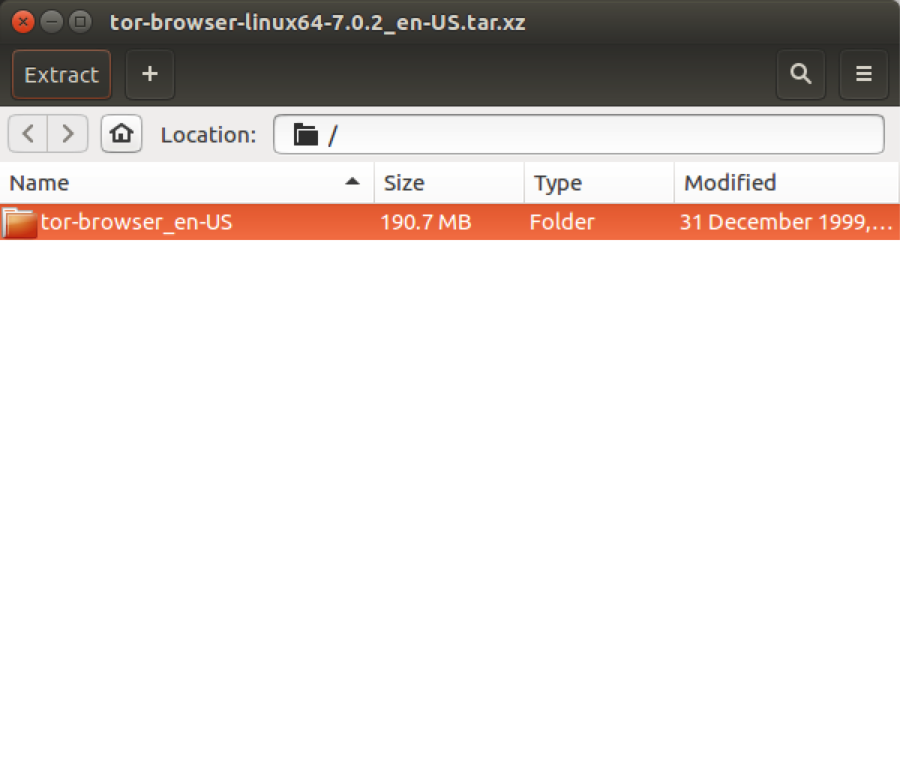

After the extraction is complete, open the “tor-browser_en-US” folder and double-click on the file “Tor Browser Setup.”

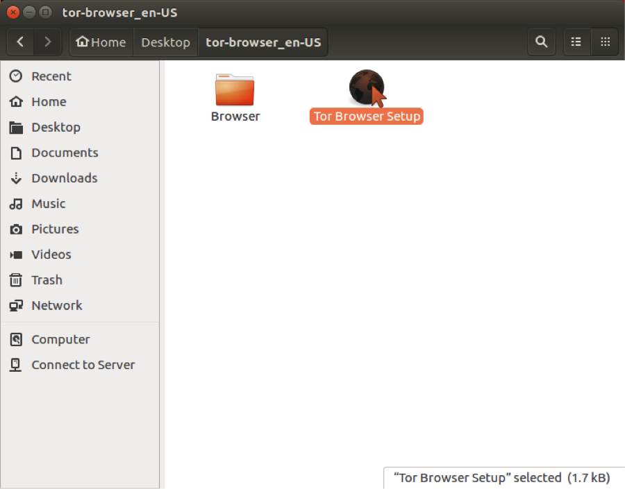
 

Using Tor Browser 
-----------------

You'll then get a window that allows you to modify some settings if necessary. You might have to come back and change some configuration settings, but go ahead and try to connect to the Tor network by clicking the Connect button.

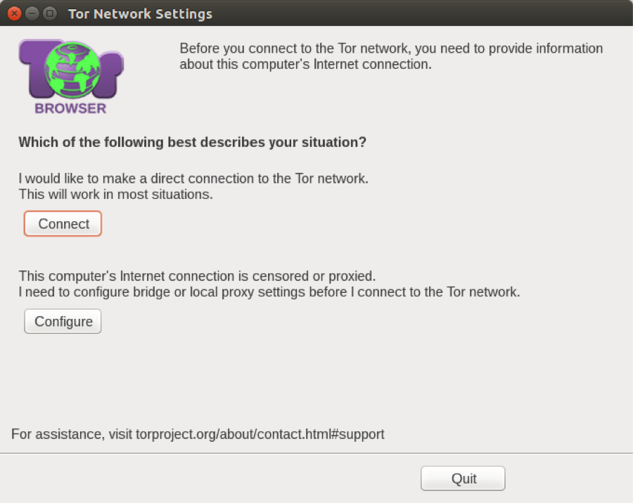

A new window will open with an orange bar that illustrates Tor Browser connecting to the Tor network.

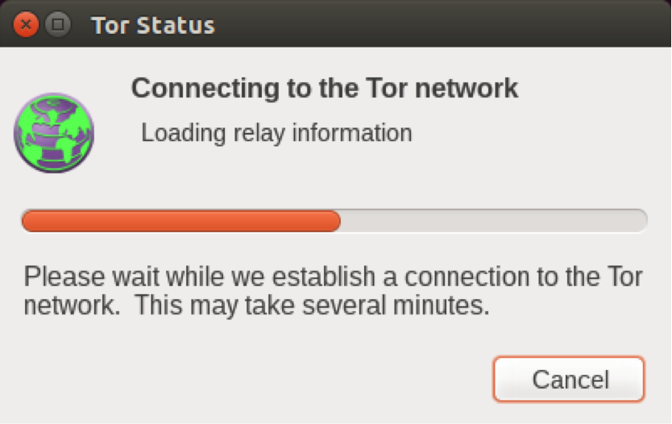

The first time Tor Browser starts, it might take a long time; but be patient, within a minute or two Tor Browser will open and congratulate you.

Click on the Tor Onion logo in the upper left of Tor Browser then the Privacy and Security Settings.

Some features of a normal web browser can make you vulnerable to man-in-the-middle attacks. Other features have previously had bugs in them that revealed users' identities. Turning the security slider to a high setting disables these features. This will make you safer from well-funded attackers who can interfere with your Internet connection or use new unknown bugs in these features. Unfortunately, turning off these features can make some websites unusable. The default low setting is fine for everyday privacy protection, but you can set it to high if you are worried about sophisticated attackers, or if you don't mind if some websites do not display correctly.

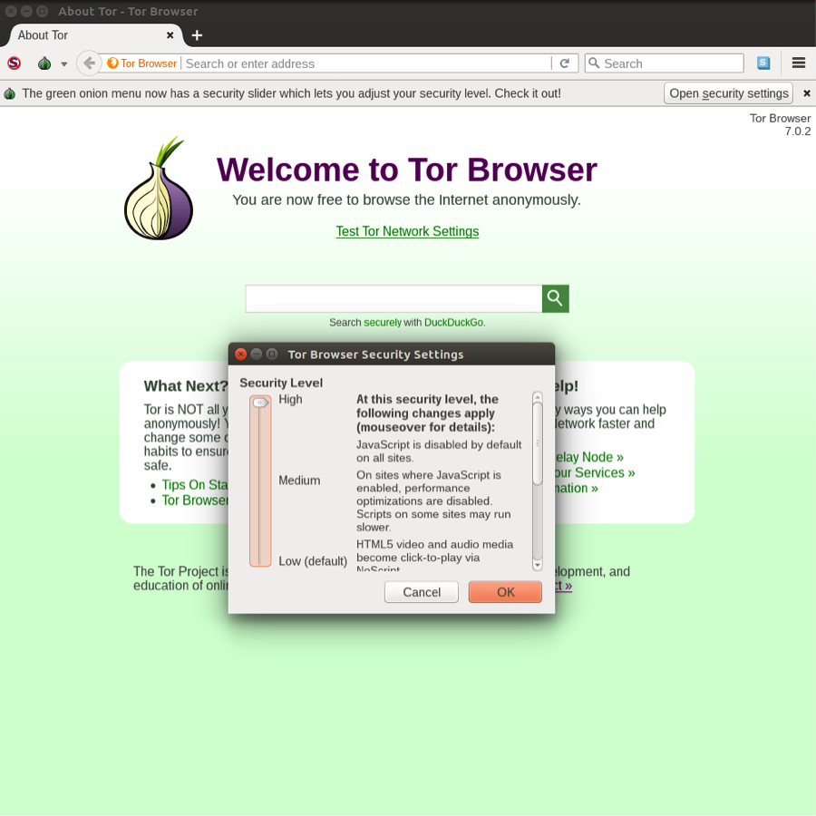

Finally, browsing with Tor is different in some ways from the normal browsing experience. We recommended reading [these tips](https://www.torproject.org/download/download-easy.html.en#warning) for properly browsing with Tor and retaining your anonymity.

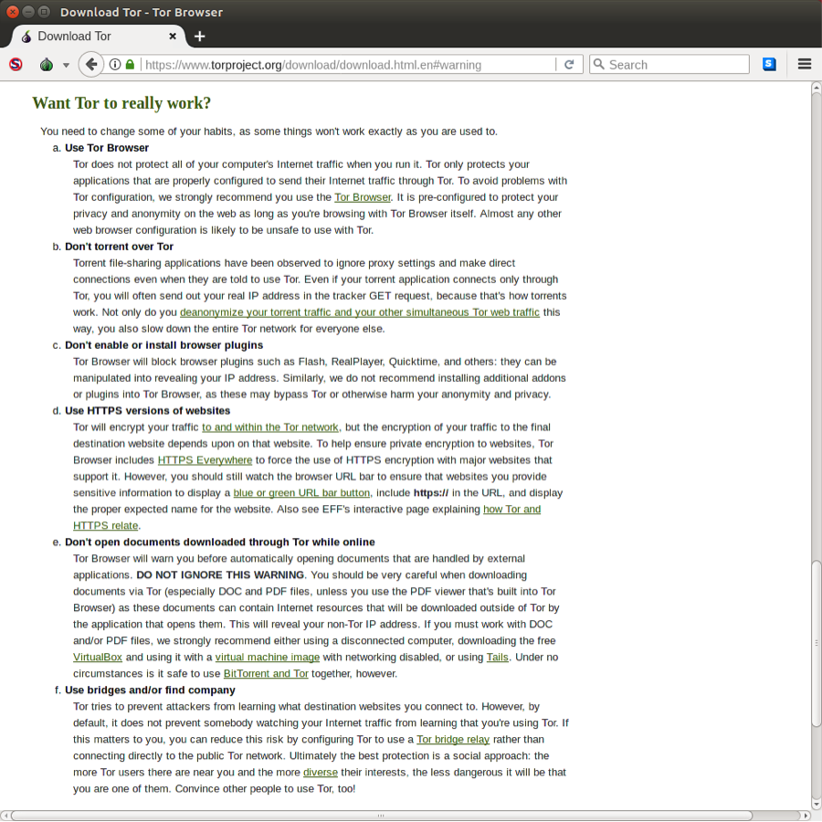

You are now ready to browse the Internet anonymously with Tor.

## Check if the Tor Browser is working

The Tor Browser hides your *IP address* from the websites you visit. If it is working properly, you should appear to be accessing websites from a location on the Internet that 

- Is different from your normal IP address
- Cannot be linked to your physical location

The simplest way to confirm this is by visiting the *Tor Check* website, which is located at [**https://check.torproject.org/**](https://check.torproject.org)

If you are **not** using Tor, it will display the following: 

 

 
If you are using Tor, it will display the following:

  

If you want to check your apparent IP address using a service that is not associated with the Tor Project, there are many options online. Examples that support *https* encryption (which makes it more difficult for someone *other* than the service provider "fake" the result) include:

- [https://www.iplocation.net/](https://www.iplocation.net/)
- [https://www.ip2location.com/](https://www.ip2location.com/)

If you access these websites *without* using the Tor Browser, they should display your real IP address, which is linked to your physical location. If you access them through the Tor Browser, they should display a different IP address.  

## How to create a new identity

You can create a "new identity" for your Tor Browser. When you do, the Tor Browser will randomly select a new set of Tor relays, which will make you appear to be coming from a different IP address when you visit websites.To do this, follow the steps below:

**Step 1**. **Open** the Tor Browser menu

 

**Step 2**. **Select** *New Identity* from the menu. 

The Tor Browser will clear your browsing history and cookies then restart. Once the it has restarted, you can confirm that you appear to be coming from a new IP address as described in the previous section.

Trouble Using Tor Browser 
-----------------

If you can't connect, try [trouble shooting](https://www.torproject.org/docs/faq.html.en#DoesntWork). 

If you still can't connect and suspect your access to Tor may be restricted, read *If the Tor Network is Blocked*, below. 

If you are planning to travel to an area where you suspect access to Tor may be restricted, read *How to reconfigure access to the Tor network*, below. 

#If the Download Page is Blocked 

* There is a mirror of the Tor Browser Bundle on [Github](https://github.com/TheTorProject/gettorbrowser). 
* You can also email gettor@torproject.org with the version you need (windows, osx or linux) in the body of the message.
* Send a direct message saying "help" to [@get_tor](https://twitter.com/get_tor) on Twitter for instructions to request Tor via DM. 

Before you download a Tor Browser package for Linux, you must determine whether you are running a **32-bit** or **64-bit** system. Before you extract it, you should verify that it is authentic.

**Step 1**. Launch the *Terminal* application

**Step 2**. Execute the following command in *Terminal*:

`uname –m`

If you are running a **32-bit** system, *Terminal* will display `i686` or `i386`. If you're running a **64-bit** system, it will display `x86_64`.

**Step 3**. **Click** the download link and save the package somewhere convenient (in your *Desktop* or *Documents* folder, for example, or on a USB storage device). You will need the **.asc** file to *verify* the authenticity of the package by verifying its signature. (See the [Tor Project's guide on verifying signatures](https://www.torproject.org/docs/verifying-signatures.html.en)). 

Verifying Tor Browser
------------------

GnuPG comes pre-installed on many Linux systems, so you can probably check the Tor Browser's *Open PGP signature* without installing additional software. (Learn more about PGP in the [Email](umbrella://communications/email/expert) lesson and [PGP for LINUX tool guide]  (umbrella://tools/pgp/s_pgp-for-linux.md).)

**Step 1**. Import the *Tor Project's* signing key (**0x4E2C6E8793298290**) by launching *Terminal* and executing the following command: 

`gpg --keyserver x-hkp://pool.sks-keyservers.net --recv-keys 0x4E2C6E8793298290`

In response, *Terminal* should display the following: 

 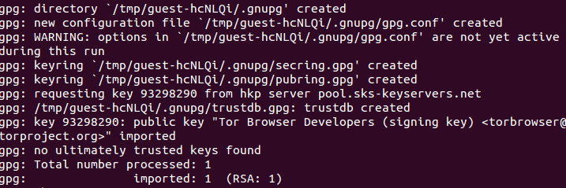 

**Step 2**. You can display information about this key by executing the following command in *Terminal*: 

`gpg --fingerprint 0x4E2C6E8793298290`

In response, *Terminal* should display the following: 

 

**Step 3**.  Using *Terminal*, enter the directory where you saved one of the two Tor Browser package files below: 

- *tor-browser-linux64-5.0.4_en-US.tar.xz* 
- *tor-browser-linux32-5.0.4_en-US.tar.xz*

This directory should should also contain one of the two signature files below: 

- *tor-browser-linux64-5.0.4_en-US.tar.xz.asc* 
- *tor-browser-linux32-5.0.4_en-US.tar.xz.asc* 

**Important**: In the examples above and below, these files are from version **5.0.4** of the Tor Browser. **Your files should have higher version numbers.**

**Step 4**. From within that directory, execute one of the following commands in *Terminal* (depending on whether you downloaded the 32-bit or the 64-bit version of the Tor Browser)

- `gpg --verify ./tor-browser-linux32-5.0.4_en-US.tar.xz{.asc*,}`
- `gpg --verify ./tor-browser-linux64-5.0.4_en-US.tar.xz{.asc*,}`

In response, *Terminal* should display the following: 

 

The above verifies that the *private key* corresponding to the *public key* you imported in *Step 1* was used to generate the signature file that you downloaded in *Step 5* of the previous section (and that this signature file applies to the Tor Browser package that you downloaded in *Step 4* of the previous section). 

**Important**: As you can see, GPG displays a warning about the key used for this signature. This is because you have not actually verified the Tor Project's signing key. The best way to do this is to meet the Tor Project developers in person and ask them for the fingerprint of their signing key. For the purposes of this guide, we are relying on the fact that a well-known Tor Project GPG key (**0x4E2C6E8793298290**) was used to create a signature file that confirms the authenticity of the Tor Browser package that you downloaded. 

# If the Tor Network is Blocked

If you want to use the Tor Browser from a location where the Tor network is blocked, you will have to use a **bridge relay**. Bridges are not listed in the public directory of Tor relays, so they are more difficult to block. Some bridges also support **pluggable transports**, which try to disguise your traffic to and from the Tor network. This helps prevent online filters from identifying and blocking bridge relays. 

The default pluggable transport, called **obfs4**, also makes it slightly more difficult for others to figure out that you are connecting to the Tor network. In general, though, Tor is not designed to hide the fact that you are using Tor.

You can learn more about bridges on the [Tor project website](https://bridges.torproject.org/). There are two ways to use bridges. You can enable the **provided bridges** or you can request **custom bridges**.

### Provided bridges

You can use provided bridges to connect to the Tor network by performing the following steps:

**Step 1**. **Double-click** the **Tor Browser Setup** file. This will display the Tor Browser configuration screen.

 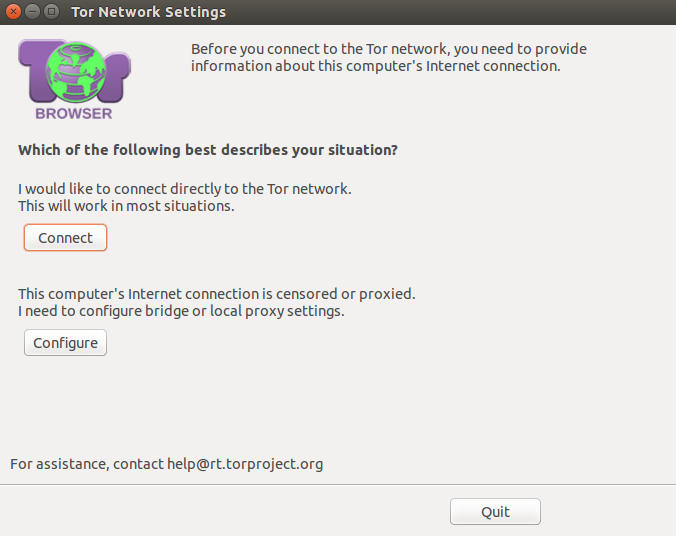

**Step 2**. If you have restricted access, **click** **[Configure]**. 

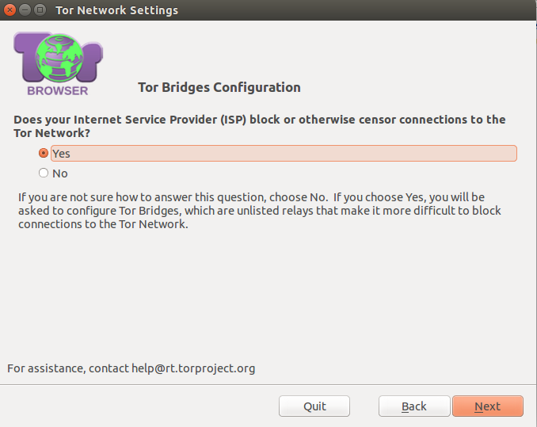

**Step 3**. **Select** **Yes**

**Step 4**. **Click** **[Next]** to display the *bridge configuration* screen

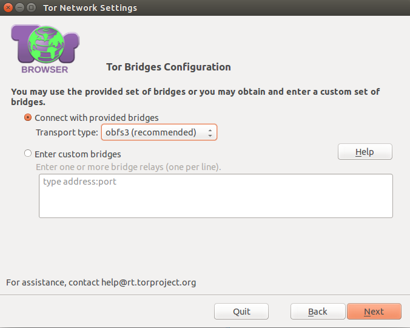

**Step 5**. **Select** **Connect with provided bridges**

**Step 6**. **Click** **[Next]** to display the *local proxy configuration* screen

The Tor Browser will now ask if you need to use a *local proxy* to access the Internet. The steps below assume that you do not. If you *do*, you can check your regular browser settings and copy over your proxy configuration. (In Firefox you can find these settings in the *Options > Advanced > Network* tab of *Connection Settings*. In other browsers you might find them under *Internet Options*. You can also use the *Help* feature within your browser for further assistance. 

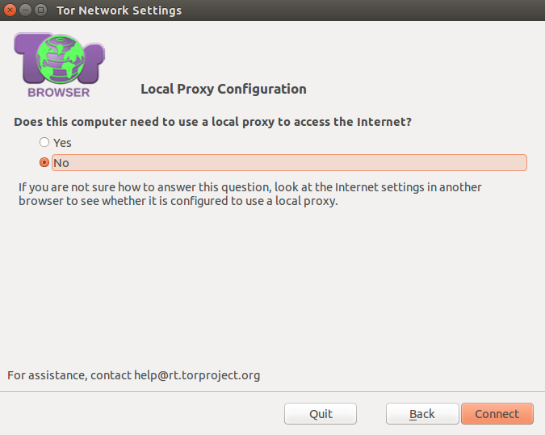

**Step 7**. **Select** **No**

**Step 8**. **Click** **[Connect]** to launch the Tor Browser

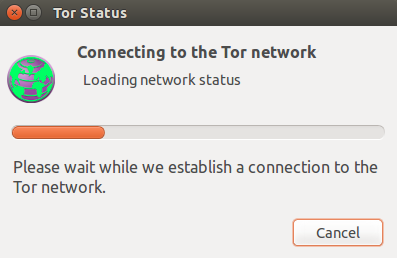

After a few moments, the Tor Browser will open.

### Custom bridges

You can also connect to the Tor network through **custom bridges**, which are used by fewer people than the **provided bridges** and are therefore less likely to be blocked. If you are unable to access the Tor Project website, you can request custom bridge addresses by sending an email to **bridges@torproject.org** using a *Riseup*, *Gmail* or *Yahoo* account. Include the phrase, **get bridges** in the body of your message

If you *can* access the Tor Project website, you can obtain custom bridge addresses by visiting **https://bridges.torproject.org/options** and following the steps below. 

**Step 1**. **Click** *Just give me bridges!*

 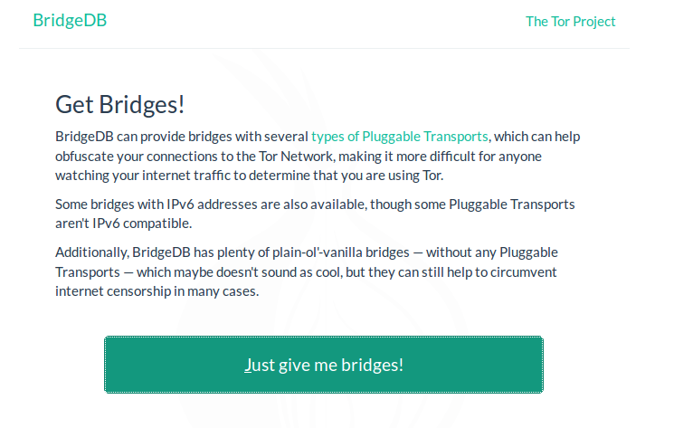

**Step 2**. Fill in the captcha and press **enter**.

 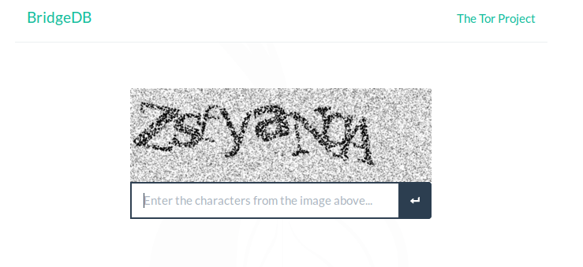

This should display three bridge addresses. 

 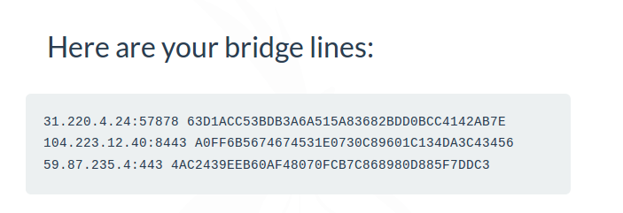

**Step 3**. Once you have your custom bridge addresses, you can **type** them into the *Tor Bridge Configuration* screen shown below.

  

## How to reconfigure access to the Tor network

At any stage, if you need to access the Tor Network a different way, for example if you have travelled to a country that blocks Tor, you can update your settings from within the browser by following the steps below:

**Step 1:** **Open** the Tor Browser menu

 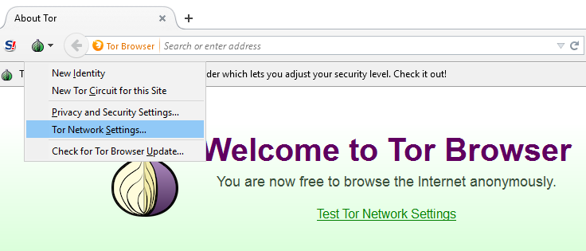

**Step 2.** **Select** *Tor Network Settings* to change how the Tor Browser connects to the Internet.

 

This screen allows you to enable or disable Bridges and add custom Bridges, among other changes. 

**Step 3**. When you are done, **click** **[OK]** and **restart** the **Tor Browser**.